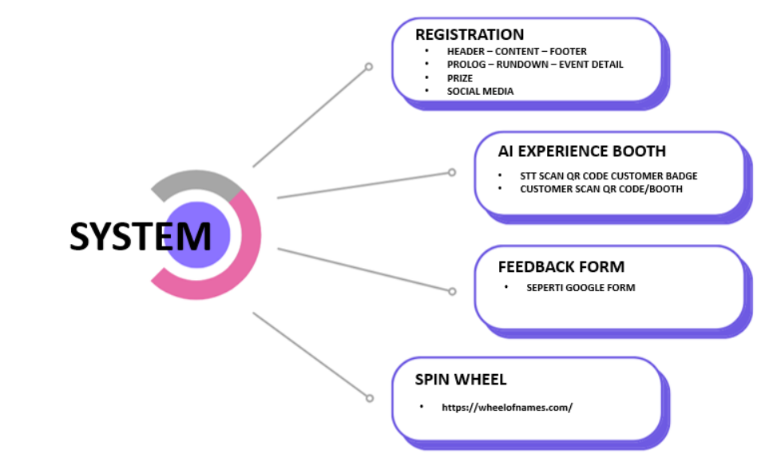

# STT Event Frontend

Aplikasi frontend untuk STT Event yang dibangun menggunakan Ionic Framework dengan Vue.js dan TypeScript.

## Diagram Sistem



## Fitur Sistem

### 1. Registration
- Sama seperti registration sebelumnya
- Dapat diakses melalui: https://event.saptatunas.com/

### 2. AI Experience Booth
- STT scan QR code customer badge
- Link QR scan data masuk ke sistem STT Event

### 3. Feedback Form
- Form feedback internal untuk pengumpulan feedback dari peserta

### 4. Spin Wheel
- Komponen roda putar custom untuk pemilihan pemenang

## Alur Registrasi Event


1. **Invitation EDM Blast**
   - Pengiriman undangan melalui email

2. **Link to Event Website**
   - Peserta diarahkan ke website event

3. **Register**
   - Peserta melakukan pendaftaran

4. **Registration Notification**
   - Sistem mengirim notifikasi pendaftaran

5. **Approval Process**
   - Proses verifikasi pendaftaran

6. **Email or Code**
   - Pengiriman konfirmasi melalui email atau kode

## Teknologi yang Digunakan

- [Ionic Framework](https://ionicframework.com/) dengan Vue.js
- Vue.js 3
- TypeScript
- Vite sebagai build tool
- Capacitor untuk aplikasi mobile

## Prasyarat

Sebelum menjalankan aplikasi ini, pastikan Anda telah menginstal:

- Node.js (versi LTS terbaru)
- npm (Node Package Manager)
- configurasi .env (Pasang env yang telah di sediakan)

## Instalasi

```bash
# Install dependensi
npm install
```

## Perintah yang Tersedia

```bash
# Menjalankan aplikasi dalam mode development
npm run dev

# Build aplikasi untuk production
npm run build

# Preview hasil build
npm run preview

# Menjalankan test end-to-end menggunakan Cypress
npm run test:e2e

# Menjalankan unit test
npm run test:unit

# Menjalankan linter
npm run lint
```

## Struktur Proyek

```
├── src/                  # Direktori source code utama
│   ├── App.vue          # Komponen utama Vue
│   ├── main.ts          # Entry point aplikasi
│   ├── router/          # Konfigurasi router
│   ├── theme/           # Kustomisasi tema
│   └── views/           # Komponen halaman
├── public/              # Asset statis
├── tests/               # Unit dan E2E tests
│   ├── e2e/            # Test end-to-end dengan Cypress
│   └── unit/           # Unit tests
└── capacitor.config.ts  # Konfigurasi Capacitor
```

## Testing

Proyek ini menggunakan:
- Cypress untuk E2E testing
- Vitest untuk unit testing

## Mobile Development

Proyek ini menggunakan Capacitor untuk pengembangan aplikasi mobile. Beberapa plugin Capacitor yang tersedia:
- App
- Haptics
- Keyboard
- Status Bar

## Kontribusi

Untuk berkontribusi pada proyek ini:
1. Buat branch fitur baru
2. Commit perubahan
3. Push ke branch
4. Buat Pull Request

## Lisensi

Proyek ini bersifat private dan hak cipta dimiliki oleh Sapta Tunas Teknologi.

        